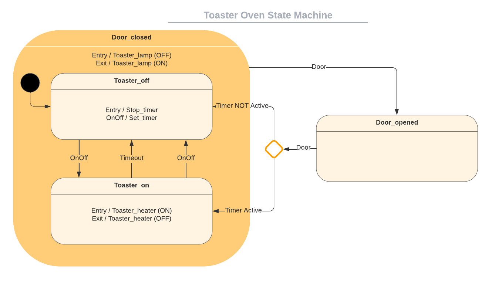
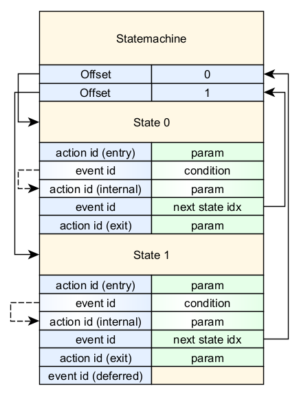
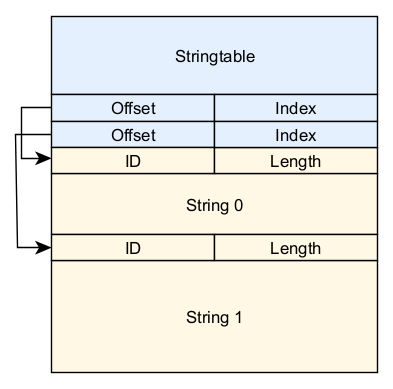

# Qoraal Engine 
 


__Engine__ is designed to execute advanced, hierarchical state machines with guard conditions. State machines are assembled from individual parts, parsed from a machine definition file written in Engine Machine Language.

__Tool__, the integrated compiler, converts Engine Machine Language files into optimized byte code, ready for execution by Engine. Lightweight and efficient, Tool enables just-in-time compilation with minimal overhead, ensuring seamless integration into your application.

__Engine__ with __Tool__ are purpose-built for embedded C or C++ applications, offering a powerful, high-performance solution for real-time state machine management. Together, they ensure optimal efficiency and reliability.


## The Proverbial "Toaster Oven"
You might be surprised to hear that Engine was designed for use with deeply embedded systems. To better understand how this works, let's consider a simple example, the proverbial "Toaster Oven":
<p align="center">

</p>

The implementation of the "Toaster Oven" in this case is fairly straightforward. The "Toaster Oven" has two events that can trigger changes in its state, "On/Off" and "Door." These events turn the oven on or off and open or close the door, depending on the current state of the toaster. The timer does not paused when the door is opened and always restart when transitioning from the *Toaster_off* to the *Toaster_on* state.

The "toaster part" includes two actions, _toaster_lamp_ and _toaster_heater_, which are written in C. For this simple demonstration, these functions simply print messages indicating that the toaster heater or lamp was turned on or off. In a real embedded application, the actual work would be performed here. With the "toaster part" implemented, we can fully define the behavior of the "Toaster Oven" using only _Engine Machine Language_ code.

With a syntax similar to C, C++, or most other programming languages, those with programming experience should have no difficulty reading the toaster's implementation in _Engine Machine Language_. There are only a few key words, like _enter_, _exit_ and _action_ which calls actions/functions with an optional parameter. The key word _event_ will initiate a transition to the next state for the specific event. But let's look at the implementation of the "Toaster Oven" before we continue.

-----

<details>
<summary>
<B>The "Toaster Oven" Engine Machine Language code:</B>
</summary>

```c
decl_name       "Toaster Oven"
decl_version    2

decl_variables {
    Timer = [timer.default] /* Reload value for the "off" timer when the toaster is started.
                               The value "timer.default" is read from a registry or config file. */
}

/* Actions can dispatch evets into state machines, their own or globally
   to all state machines. We declare a few events here fo use by the
   state machines. */
decl_events {
    _evt_Door
    _evt_OnOff
}

statemachine Toaster_oven {

    /* On startup, transition to Toaster_off. It is
       assumed the door is closed. */
    startstate Toaster_off

    state Door_closed {

        /* Transtioning from Door_open to any of the Door_closed
           substates will call the entry actions defined here. */
        enter       (toaster_lamp, OFF)

        /* For any of the Door_closed substates the Door event
           will transition to the Door_open state. */
        event       (_evt_Door, Door_opened)
        
        /* When the door is no longer closed, the lamp is turned on. */
        exit        (toaster_lamp, ON)

    }
    super Door_closed {

        /* All states in this scope takes Door_closed as 
           super state. Entry and Exit actions during state
           state transitions will happen according to the UML
           specification. Super states can be nested. */

        state Toaster_off {

            /* Reset the timer. */
            enter       (state_timer1_sec, 0)

            /* Set the timer. */
            action      (_evt_OnOff, state_timer1_sec, [Timer])

            /* Transition to Toaster_on. */
            event       (_evt_OnOff, Toaster_on)

        }

        state Toaster_on {

            /* On entry, turn the heater on. */
            enter       (toaster_heater, ON)

            /* When the timer expires, transition to Toaster_off. */
            event       (_state_timer1, Toaster_off)
            /* On the OnOff event, transition to Toaster_off. */
            event       (_evt_OnOff, Toaster_off)

            /* On exit, turn the heater off. */
            exit        (toaster_heater, OFF)

        }

    }


    state Door_opened {

        /* When the door is closed, check if the timer is active
           and load the result into the accumulator. */
        action_ld (_evt_Door, [a], state_timer1_active)

        /* If the accumulator is set, transition to Toaster_on. */
        event_if (_evt_Door, Toaster_on)
        /* If the accumulator is clear, transition to Toaster_off. */
        event_nt (_evt_Door, Toaster_off)

    }

}
```

</details>

-----


The code snippet above doesn't include the _Toaster_controller_ state machine, which runs in parralel, which implements a controller interface for the toaster. This interface generates the *_evt_OnOff* and *_evt_Door* events and allows you to change the toaster's settings such as the timer duration. It displays a menu for these options and prints out the current settings of the toaster. You can find the complete _Engine Machine Language_ code for the "Toaster Oven" example in the [toaster.e](./test/toaster.e) file.

## Test Driving Engine

First, _Engine_ with _Tool_ must be compiled from the sources in the repository. To compile and run the project in a codespace, just start a codespace from the repository using the ``` <> code ``` button in the code view of the repository. When the codespace is open in the browser, use the following commands in the terminal that opened in the browser to compile and run the project (if the terminal is not open use ```ctrl + ` ``` to open the terminal):
```
mkdir build
cd build
cmake ..
cmake --build .
cd ..
```
> :bulb: Or use the script 'build_and_run.sh' on Linux or 'build_and_run.bat' on Windows.

> :bulb: To do a clean build, start with: ``` cmake --build . --target clean ``` or, if you want to check out qoraal again: ```rm -rf build/_deps```

now start the engine to run the toaster with the folloing command:
```
./build/qoraal-engine ./test/toaster.e
```
> :bulb: Use the --help option to display the command line syntax: ``` ./build/engine  --help ``` 


When you start the "toaster.e" machine, you will be presented with a menu.

-----

<details>
<summary>
<B>The Toaster_controller menu:</B>
</summary>


```
'My Toaster' settings:
    - Timer: 10s
    - Log Level: ALL
    - Log Output: ENABLED
Control menu:
    [t] Toaster On/Off.
    [d] Door Open/Close.
    [s] Settings.
    [h] Help.
```

</details>

-----

_Engine_ provides extensive logging for debugging state machines. As shown in the menu above, the log level is set to ALL. So lets dispatch a few commands and look at the output. Type "tdd" in the console and press enter. This will turn the toaster on (t) and open the door (d) and close the door again (d). The debug log below should be generated:

> :bulb: In the following debug log, 0x700 is the "Door" event and 0x701 is the "OnOff" event. The text preceded by the `####################` is debug output geberated the actions itself and not the state machine. All other logging is generated by Engine.

-----

<details>
<summary>
<B>The Test Drive log:</B>
</summary>


```
562.798: [evt] ---* 0x701 ([a] 1, [e] 0)
562.800: [act]      state_timer1_sec   [5] 10
562.803: [trn] ---> 'Toaster_off' to 'Toaster_on'   () ([a] 1, [r] 0)
562.806: [ext] ---- exit actions (Toaster_off):
562.808: [ent] ---- entry actions (Toaster_on):
562.810: [ent]      toaster_heater , 1
562.811: #################### HEATER ON
562.812: [evt] ---* _state_start ([a] 1, [e] 0)
562.817: [evt] ---* 0x700 ([a] 1, [e] 0)
562.819: [trn] ---> 'Toaster_on' to 'Door_opened'   () ([a] 1, [r] 0)
562.823: [ext] ---- exit actions (Toaster_on):
562.825: [ext]      toaster_heater , 0
562.827: #################### HEATER OFF
562.830: [ext] ---- exit actions (Door_closed):
562.832: [ext]      toaster_lamp , 1
562.834: #################### LAMP    ON
562.835: [ent] ---- entry actions (Door_opened):
562.837: [evt] ---* _state_start ([a] 1, [e] 0)
562.839: [evt] ---* 0x700 ([a] 1, [e] 0)
562.840: [act]      state_timer1_active  (ld [0] 1) 0
562.842: [trn] ---> 'Door_opened' to 'Toaster_on'   (if) ([a] 1, [r] 0)
562.845: [ext] ---- exit actions (Door_opened):
562.847: [ent] ---- entry actions (Door_closed):
562.848: [ent]      toaster_lamp , 0
562.850: #################### LAMP    OFF
562.851: [ent] ---- entry actions (Toaster_on):
562.853: [ent]      toaster_heater , 1
562.855: #################### HEATER ON
562.857: [evt] ---* _state_start ([a] 1, [e] 0)
572.806: [evt] ---* _state_timer1 ([a] 1, [e] 0)
572.809: [trn] ---> 'Toaster_on' to 'Toaster_off'   () ([a] 1, [r] 0)
572.817: [ext] ---- exit actions (Toaster_on):
572.820: [ext]      toaster_heater , 0
572.822: #################### HEATER OFF
572.824: [ent] ---- entry actions (Toaster_off):
572.827: [ent]      state_timer1_sec , 0
572.828: [evt] ---* _state_start ([a] 1, [e] 0)
```

</details>

-----


The log displays the time in seconds on the left followed by the action as described in the following table:

| Header    | Description |
|---   |---|
|``` [ent] ```  | Entry action.|
|``` [act] ```| Internal transitions where an event has trigering an action.|
|``` [ext] ```  | Exit action.|
|``` [evt] ```   | Event. If it is a built in event from a part the text will be displayed. Events declared in the "decl_events" section start from 0x700.|
|``` [trn] ```   | A transition was triggered by the previous event. This will be followed by all the exit and entry actions for all the states and super states as defined by the UML specification.|
|``` ####### ```|Debug output printed by the toaster part|

According to the log, the toaster turns on and the door opens shortly thereafter. When the door is closed, the toaster returns to 'Toaster_on' state because the timer has not yet expired, as expected.

Additional logging output shows the different registers implemented that can be used by guards for conditional execution of actions or transitions. Registers, as well as variables and indexed variables, are referenced using square brackets for example [a] for the "accumulator", [r] for the "register" and [e] for the "event register". But more about this later.

> :bulb: "toaster.e" requires a configuration file named "toaster.cfg" to be located in the same directory. Alternatively, the location of the configuration file can be specified on the command line, if it has a different name.

## A Real World Example

The example below features a small OLED display used in a real-world application, a battery-powered Wi-Fi toaster with a three-button capacitive touch input. The video demonstrates the display and how to change the timer on the toaster.

<p align="center">

</p>

> :wink: I mean, I'm pretty sure there's no actual battery-powered Wi-Fi toaster out there in the world... or at least, I hope not. That would be way too much technology for a humble toaster. This was just an excuse to show off the awesomeness of Engine!

 
# Engine byte code
Before we delve into the syntax of _Engine Machine Language_, let's first consider the end result, the byte code that is produced when _Tool_ compiles it. With this "end in mind," we can better understand the inner workings of _Tool_ as it translates _Engine Machine Language_ into byte code.

_Tool_ includes a lexer and a parser which work together to create byte code for machines that can be executed by the _Engine_. This byte code is position-independent, meaning it can also be pre-compiled and linked as a resource to be executed from any memory if desired.

Each state machine is created in a contiguous block of memory where the state machine header is followed by a indexed lookup table containing the offsets to the individual states. A state has a header followed by the state data. State data consists of an array of action or event identifiers followed by a parameter. Depending on the context, the parameter will be interpreted differently. The following image illustrates the memory layout of a simple state machine with two states:


 
> :bulb: External transitions are shown with solid lines while the internal transitions are shown with dotted lines.

In this example, each state has one entry and exit action, one internal transition and one external transition, but the total number of events, deferred events, entry actions, exit actions and actions (internal transitions) can be up to 255 each.

The state header contains the number of events, deferred events, entry actions, exit actions and actions (internal transitions) in the state data.

## Actions (entry & exit)
Actions can be entry or exit actions or actions of internal transitions.


Param is a 16 bit integer but should be interpreted by the action according to thhe TYP bits.
|Bits|Description|
|---|---|
|Bit_31:30| Type: <br/>0 - constant <br />1 - indexed (string index into a registry. This index must be loaded from the string table)<br/>2 - string (must be loaded from the string table)<br/>3 - variable (an identifier in square brackets. This is a 32 bit integer) |
|Bit_29:28|Operation to perform before or after the action: <br/> 0 - nothing. <br/>1 - push (acumulator pushed and result save in accumulator)<br/>2 - pop (pop accumulator before the action)<br/>3 - save (result saved in the register)

## Actions (internal)
The following bits depict how the event bits are interpreted for an internal transition.


|Bits|Description|
|---|---|
|Bit_31| If set, the value in the comparator is a variable, otherwise it is a constant|
|Bit_30:28|How the comparator is evaluated to determin if the action should be executed:<br/>1 - If event register equal to the comparator. <br/>2 - If the comparator less than the accumulator.<br/>3 - If the comparator greater than the accumulator.<br/>4 - If the comparator is equal to the accumulator.<br/>5 - If the comparator is not equal to the accumulator.<br/>6 - Will load the result of the action into the variable in the comparator.|
|Bit_27|If set, this will terminate the evaluation of the event for further actions.|
|Bit_26:16|Event id to identify if the action that follow in the next 32 bits will be executed.|
|Bit_15:0|Comparator to determine of the action should be executed. This could be a constant or a variable|

## Events
The event bits are interpreted differently for an internal transition than for an external transition. The following bits depict an external transition.


|Bits|Description|
|---|---|
|Bit_31| Previous pin. If set it will toggle pushing the previous state stack. Transitioning to the PREVIOUS state will always be the state where this bit was set.|
|Bit_30:28|Guard condition for the event to trigger a transition:<br/>1 - If accumulator set.<br/>2 - If accumulator NOT set.<br/>3 - If register is set.<br/>4 - If register NOT set.|
|Bit_26:16|Event id to identify if the transition to the next state should occur.|
|Bit_15:0|Next state index.|

## Deferred Events
Deferred events are saved until after the next transition.


|Bits|Description|
|---|---|
|Bit_26:16|Event id for events that should be deferred.|

## The String Table

All strings in the machine definition file is copied into the stringtable. 



Engine references strings through their index in the stringtable. A string has a 16 bit ID and a 16 bit length field followed by the actual string.

# Tool

Tool is a compiler taking _Engine Machine Language_ and compiles it to byte code that is executed by _Engine_.

## The Machine Definition

A machine definition consists of declarations and one or more state machines. A state machine is made up of one or more states that can be organised into super-states and sub-states.

-----

<details>
<summary>
<B>Machine Definition:</B>
</summary>


```c
<declarations>

statemachine <name_1> {

	startstate <state_s11>
	
	state <state_s1> {
	
	}
	super <state_s1> {
	
		state <state_s11> {
		
		}
	
		state <state_s12> {
		
		}
		
		super <state_s12> {

			state <state_s121> {
			
			}
		
			state <state_s122> {
			
			}

		}
	
	}
	
	state <state_s2> {
	
	}
	
	...
	...

}

...
...

statemachine <name_x> {
	
	...
	...	
	
}
```

</details>

-----

### Declarations


The following declarations can be done outside the scope of the state machines. 

> :bulb: All declarations are optional.

|Name|Description|
|---|---|
|``` decl_name ```|Description: Set the name for the assembly of state machines in the machine definition file.|
|``` decl_version ```|Set the version for the assembly of state machines in the machine definition file.|
|``` decl_variables ```|Declares a list of initialised variables.|
|``` decl_events ```|Declares events that can be used as a parameter for an action.|
|``` decl_startup ```|Declares a list of initialization shell commands.|


### Statemachines

After the declarations one or more state machines can be defined. All states inside of the superstate scope will have the specific state in the "super" as super state. Super states can nest up to defined maximum.

As many as the defined maximum state machines can be declared. Events will be dispatched to the state machines in the order they are declared. Processing of the event is complete once it has been dispatched to all state machines. Only one event will be active at a time.

### States

-----

<details>
<summary>
<B>State Definition:</B>
</summary>

```c
state <name> {
	enter 		(<action>[op], 	[param])
	action 		(<event>[op], 	<action>[op], 	[param])
	action_xx 	(<event>[op], 	<comparator>, 	<action>[op], 	[param])
	event 		(<event>[op], 	<state>)
	event_xx 	(<event>[op], 	<state>)
	deferred 	(<event>)
	exit 		(<action>[op], 	[param])
}
```

</details>

-----

Declarations inside a state, such as events, actions, etc., can be placed in any order and may be mixed together. However, they will be evaluated in the order in which they were declared.

After transitioning to a state, the entry actions will be executed starting with the least common ancestor (LCA) superstate and progressing down to the current state

If an event is dispatched, the following actions will be taken in the following order:
1. Deferred events will be saved for later processing. If the dispatched event was deferred, the event processing will be terminated.
2. Actions associated with internal transitions, if defined for the event, will be executed based on a guard. THis will start with the current state and progressing up to the top-most superstate. It is possible for zero or more actions to be executed for a single event. If the termination flag is set, the evaluation of the event for further actions in the current state and superstates will be terminated after the action has been executed.
3. Finally, the evaluation process for potential transitions will begin at the current state and progress up to the superstate. An event with a guard is able to trigger a transition. If the resulting transition leads to the IGNORE state, the evaluation of the event for transitions will end and no transition will take place.

If a transition is triggered, exit actions will be executed starting with the current state and progressing up to the LCA superstate.

#### Parameters

Parameters may be simple constants with a 16-bit integer value, but registers or variables, which are 32-bit integer values passed to the C implementation of the action, can also be used. Registers and variables are denoted in square brackets.

|Register|Description|
|---|---|
|``` [a] ```| Accumulator. Can be used for arithmetic operations. Can also be pushed and popped from a stack. This is local for each instance of an Engine.|
|``` [e] ```| Event register. Can b e used for arithmetic operations. Can also be pushed and popped from a stack. This is local for each instance of an Engine.|
|``` [r] ```| General purpose register. It can be used for some guarded transitions. This is local for each instance of an Engine.|
|``` [p] ```| General purpose register. By convention used as a second parameter for an action. This is local for each instance of an Engine.|
|``` [<variable>] ```|Any variables declared in the "decl_variables" section is global to all instances of Engines.|
|``` [<registry>] ```|A string that can be used for registry lookup if implemented by the port.|

#### Guards

For the declarations of the action or events in the state "_xx" demotes guard conditions. For guard conditions, a register is compared to a "comparator" which can be a constant, variable or register. The following guards are defined:
|Guard|Description|
|---|---|
|``` action ```|No guard, the action will always execute.|
|``` action_eq_e ```|The action will execute if the event register is equal to the comparator.|
|``` action_lt ```|The action will execute if the accumulator is less than the comparator.|
|``` action_gt ```|The action will execute if the accumulator is greater than the comparator.|
|``` action_eq ```|The action will execute if the accumulator is equal to the comparator.|
|``` action_ne ```|The action will execute if the accumulator is not equal to the comparator.|
|``` action_ld ```|This is not a guard but the result of the action will be loaded into the comparator if it is a register or a variable.|
|``` event ```| No guard. The transition will always trigger|
|``` event_if ```|The transition will trigger if the accumulator is set.|
|``` event_if ```|The transition will trigger if the accumulator is clear.|
|``` event_if_r ```|The transition will trigger if the register is set.|
|``` event_nt_r ```|The transition will trigger if the register is clear.|

#### Operators

Optional operators ([op]) can be used with actions and events. The following operators are defined:
|Op|Use_With|Name|Description|
|---|---|---|---|
|``` + ```|action|Push|After the action was executed, the accumulator will be pushed and the result of the action will be saved in the accumulator.|
|``` - ```|action|Pop|Before the action is executed, the accumulator will be popped from the stack.|
|``` = ```|action|Save|After the action was executed, the result of the action will be saved in the register.|
|``` ^ ```|event|Pin|State transitions will no longer be pushed on to the previous state stack. The next transition to the "PREVIOUS" state will transition to this state. On a previous transition the previsous pin will be cleared".|
|``` ! ```|event|Terminate|No more actions will be executed for this event.|

# Engine Parts

Engine can be extended with new parts. There are three things a part can export to use from Engine Machina Language, these are: actions, events and constants.

Using the demo application you can list al the part's actions, events and constants using the "--list" command line option.

<details>
<summary>
<B>Demo application actions, events and constants:</B>
</summary>

```
Actions:
    a_add                    [a] += parm. return [a].
    a_and                    [a] = [a] && parm. return [a]
    a_dec                    [a]-- (down to parm). return [a].
    a_div                    [a] /= parm. return [a].
    a_eq                     return [a] == parm.
    a_get                    return [a].
    a_gt                     return [a] > parm.
    a_inc                    [a]++ (up to parm).  return [a].
    a_load                   [a] = parm. return [a]
    a_lt                     return [a] < parm.
    a_mod                    [a] %= parm. return [a].
    a_mov                    [r] = [a]. return [a]
    a_mult                   [a] *= parm. return [a].
    a_not                    [a] = ![a]. return [a].
    a_or                     [a] = [a] || parm. return [a]
    a_pop                    Pop accumulator.
    a_push                   Push accumulator.
    a_sub                    [a] -= parm. return [a].
    a_swap                   Swap accumulator.
    console_events_register  Register "statemachine" to receive console events
    console_write            Write a 'character' the console.
    console_writeln          Write a "line" to the console.
    debug_dump               Dump the current state of all state machines.
    debug_log_level          Set the log level. To be used with the LOG_XXX constants.
    debug_log_output         ENABLE/DISABLE output logging
    debug_log_statemachine   A space separated list of statemachine to enable logging for.
    e_eq                     return [e] == parm.
    e_gt                     return [e] > parm.
    e_lt                     return [e] < parm.
    get                      Load and return the value.
    nop                      No Operation
    p_add                    [p] += parm. return [p]
    p_load                   [p] = parm. return [p]
    r_clear                  [r] = 0. retutn [r].
    r_inc                    [r]++. return [r].
    r_load                   [r] = parm. return [r].
    r_set                    [r] = 1. retutn [r].
    rand                     Return rand value % parm.
    state_event              Fire the event to all state machines
    state_event_if           Fire the event to all state machines if accumulator set
    state_event_local        Fire the event to this state machine only
    state_event_local_if     Fire the event to this state machine only if accumulator set
    state_event_local_not    Fire the event to this state machine only if accumulator clear
    state_event_not          Fire the event to all state machines if accumulator clear
    state_keepalive1         Set state keep-alive  timer (autorepeat milliseconds)
    state_keepalive1_sec     Set state keep-alive  timer (autorepeat seconds)
    state_keepalive2         Set state keep-alive  timer (autorepeat milliseconds)
    state_keepalive2_sec     Set state keep-alive  timer (autorepeat seconds)
    state_timeout            Set state timeout timer (milliseconds) (cancelled on the first transition)
    state_timeout_sec        Set state timeout timer (seconds) (cancelled on the first transition)
    state_timer1             Set state timer 1 (milliseconds)
    state_timer1_active      Return TRUE if timer active
    state_timer1_sec         Set state timer 1 (seconds)
    state_timer2             Set state timer 2 (milliseconds)
    state_timer2_active      Return TRUE if timer active
    state_timer2_sec         Set state timer 2 (seconds)
    strlen                   Return the string length.
    toaster_heater           Turn the heater ON/OFF.
    toaster_lamp             Turn the lamp ON/OFF.
Events:
    _console_char            A character was received in [e].
    _state_keepalive1        Event for state_keepalive1()
    _state_keepalive2        Event for state_keepalive2()
    _state_start             State start (always the first event after a transition).
    _state_timeout           Event for state_timeout()
    _state_timer1            Event for state_timer1()
    _state_timer2            Event for state_timer2()
    _toaster_smoke_alert     Toaster smoak alert event.
Constatnts:
    CURRENT (-3)             Current State  (use instead of a state name for an event transition)
    DISABLE (0)              Disable
    ENABLE (1)               Enable
    FALSE (0)                False
    IGNORE (-4)              Ignore State  (use instead of a state name for an event transition)
    INVALID (-1)             Invalid State (use instead of a state name to for an event transition)
    LOG_ALL (2046)           Log level ALL
    LOG_NONE (0)             NO logging
    LOG_REPORT (6)           Log level REPORT
    LOG_TRANSITIONS (70)     Log TRANSITIONS only
    OFF (0)                  Turn heater/lamp OFF
    ON (1)                   Turn heater/lamp ON
    PREVIOUS (-2)            Previous State  (use instead of a state name for an event transition)
    TRUE (1)                 True
    VAL_MAX (32767)          Maximum for constant value
    VAL_MIN (-32768)         Minimum for constant value
```

</details>

The name on the left is the name as it would be used from an _Engine Machine Language_ file.

## Adding Actions

The C action prototype looks like this:
```c
int32_t action_part_action (PENGINE_T instance, uint32_t parm, uint32_t flags) ; 
```
The _instance_ argument is the instance of the engine, or state machine this action is called from. It can be used with the engine API defined in"engine.h".

The _parm_ argument is passed from the statemhine and should be interpreted according to the flags.

The flags are defined in parts.h and can be one of the following:
|Flag|Description|
|---|---|
|PART_ACTION_FLAG_VALIDATE|Only validate the parm and return ENGINE_OK if it is valid for the action|
|PART_ACTION_FLAG_INDEXED|This is an indexed variable and parm should be used to do the lookup in the registry to load a value. The value can be anything the registry supports. The Tool compiler uses parm as an string table index for use with a registry with string keys, so a lookup in the string table should be done first.|
|PART_ACTION_FLAG_STRING|Parm should be used to get the string from the strin table using the API exported in "engine.h"|
|PART_ACTION_FLAG_VARIABLE|Parm is a register or variable. Parm is already loaded with the value.|

To export this action for use with the _Tool_ compiler also add the following declaration:
```c
ENGINE_ACTION_IMPL	(part_action, "Example action.") ;
```

Now in the machine definition file this new action can be used like this, for example performing an entry action for a state:

```c
enter (part_action, TRUE)	
```

## Adding Events

Adding a event can be done with a single declaration in the C code of the part:

```c
ENGINE_EVENT_IMPL (_part_event, "Example event") ;
```

From the C code of the part, the event can be dispatched to one or more state machines using the following code:

```c
engine_queue_event (engine, ENGINE_EVENT_ID_GET(_part_event), 0);
```
The first parameter is the instance. If it is NULL the event will be dispatched to all state machines. The last parameter is the event register that can specify the event if required. From the state machine it can now be used as follows:

```c
action (_part_event, part_action, FALSE)
```
This is a internal transition simply executing the part_action with the parameter FALSE.

## Adding Constants

Constants are declared as follows in the C code of the part:
```c
ENGINE_CONST_IMPL (1, TRUE,  "True") ;
ENGINE_CONST_IMPL (0, FALSE, "False") ;
```

# Conclusion

Engine can be useful for separating the functionality or top-level state machine of your implementation from the rest of the code. This separation can be useful in some situations as it can help to create a clear boundary between different parts of the system.

The ability to use different state machines in a program without the need for recompiling the source code can have benefits for embedded systems, such as the ability to run unit tests more easily. Another benefit is the ability to run different variations of the program by choosing a different state machine as a runtime option.

The way the compiled code is executed, it is likely to be just as fast as native C. The straightforward syntax of _Engine Machine Language_ makes it ideal for development using a text editor. With an editor that supports folding and unfolding of curly brackets, Engine may even be more convenient to use than many visual design tools. Another advantage of this is that there are no code generators involved, and this usually results in a greater level of control and flexibility over the final product.

# Acknowledgements

The idea for the project came from Pico C. The lexer of Pico C was used with a few modifications and the parser changed to parse _Engine Machine Language_ syntax. Pico C (https://gitlab.com/zsaleeba/picoc) is published under the "New BSD License". http://www.opensource.org/licenses/bsd-license.php

To draw the bitfields in the "Engine Byte Code" section I used the
wavedrom bitfield library, very easy to use: https://github.com/wavedrom/bitfield. After installing you can just use a command like this to create the bitfield:
```
npx bit-field -i event.json > event.svg
```

The mp4 of the real world example was converted to a gif with https://ezgif.com/video-to-gif.

It was a nice surprise to see trains included in the search for the logo, _Engine_. Given the interest in trains that's common among engineers, http://clipart-library.com/clipart/steam-train-cliparts_6.htm should be a great representation.
