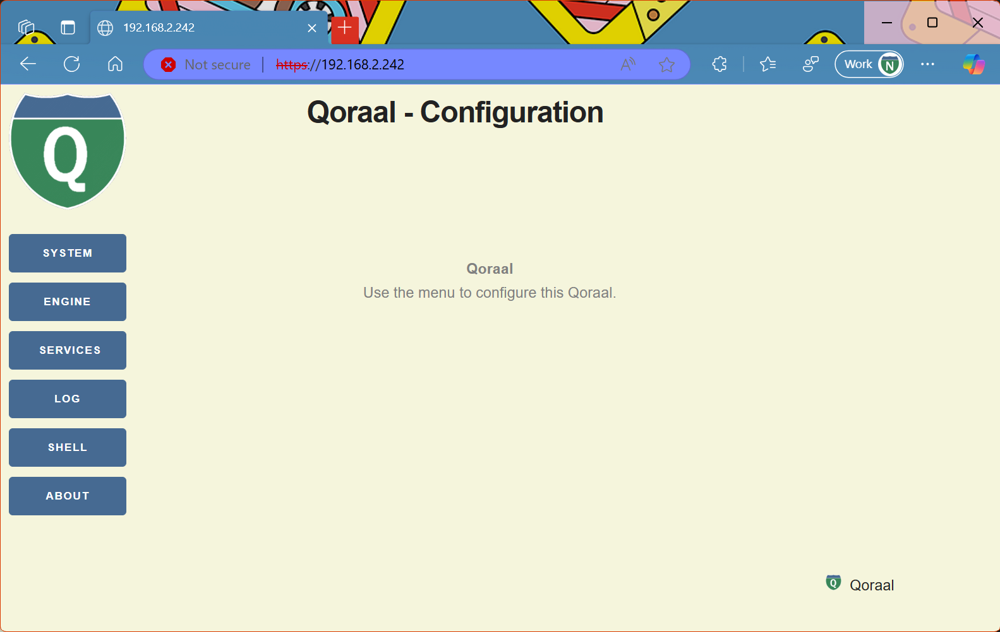

# Qoraal HTTP Module

## Features

- **Using BSD Socket Network Interface** – Can be ported to most platforms.
- **MBedTLS Integration** – Optional SSL/TLS support for secure communication.
- **Authentication Backend Plugin** – Easily integrate custom authentication mechanisms.
- **Basic Authentication Support (HTTP)** – Built-in support for HTTP Basic Authentication.
- **Customizable HTTP Headers** – Fully customizable HTTP request and response headers in the API.
- **WebSockets Support** – Optional WebSockets integration for real-time communication.
- **Multithreaded Webserver** – Included implementation to handle multiple requests concurrently.
- **Low Memory Footprint** – Optimized for embedded systems with constrained resources.
- **Flexible Modular Design** – Framework supports modular development for maintainable and scalable applications.

## Quick Start  

The demo application can be compiled using the **POSIX port**, allowing you to evaluate it directly in a **GitHub Codespace** or on your PC! For embedded targets, the following RTOS options are supported: **ChibiOS, FreeRTOS, and ThreadX** (provided you have an IP stack like **LwIP**).  

⚠️ **Note:** If running in **GitHub Codespaces**, the application will use **port forwarding**. Once the server starts on port 8080, you'll get a browser link for accessing the web interface on that port.

### Running on Windows/Linux/Codespace  

1. Open your development environment and **clone the repository**. If you open a **GitHub Codespace**, the repository is preloaded—just open a terminal (ctrl+`). 
2. Run the appropriate script based on your OS:  

```sh
# For Linux or Codespace:
$ sh ./build_and_run.sh  

# For Windows:
> build_and_run.bat  
```

3. When the application starts, a shell will open in the terminal, displaying **startup logs**. Look for `WSERV : : web server running on port 8080 without SSL!!`. 
4. Now you can access the web interface:
   - In a codespace, click on the link for the forwarded port. This should show in the `PORTS` tab of your terminal.
   - On your local PC, use **http://127.0.0.1:8080** (or your build machine’s local IP if running remotely).


That’s it—you're up and running! 🚀  


## Overview
The **Qoraal HTTP Module** is a lightweight and efficient HTTP implementation designed for embedded systems. It consists of three core components:

- **HTTP Server** – A minimal and efficient HTTP server implementation.
- **HTTP Client** – A lightweight HTTP client with optional WebSockets support.
- **HTTP WebSockets** – Extends the HTTP Client, enabling WebSocket upgrades for real-time communication.
- **HTTP WebAPI** – A standard JSON-over-HTTP API with automatic Swagger documentation generation.
- **HTTP Parser** – A shared module used by both the server and client for request and response parsing.

Additionally, a **multithreaded web server implementation** is included, built on top of the HTTP Server API, making it easier to develop scalable network applications. When needed, it also provides a flexible framework for structured content management, supporting dynamic and modular implementations.

This module is optimized for small memory usage, making it well-suited for embedded applications. Below is a memory usage comparison when compiled with and without WebSockets support:

### Memory Usage Summary

| Module | TEXT (bytes) | DATA (bytes) |
|--------|------------|------------|
| HTTP Parser (Required by all components) | 2074  | 276 | 
| HTTP Server | 2902  | 190 |
| HTTP Client | 2764  | 1051 |
| Multithreaded Webserver (Requires HTTP Server) | 1102 | 307 | 
| HTTP WebSockets (Requires HTTP Client) | 1136 | 490 | 

 - Compiled for a Cortex M33 using GNU C, optimized for size (-Os).
 - An aditional 4K RAM read/write buffer required per connection (configurable).
 - Memory usage excludes IP stack and SSL stack.

## Using the Web Server



### Setting Up the Server
The web server is created using the **HTTP Server API** by defining handlers and callbacks for headers and footers to build the framework. Here's an example of setting up the server:

```c
int32_t
wserver_start (uintptr_t arg)
{
    uint32_t port = 8080; // Specify the port
    bool ssl = false;     // SSL configuration

    // Define headers and footers for the framework
    static const WSERVER_FRAMEWORK wserver_std_headers[] = {
            wserver_header_start,
            wserver_handler_framework_start,
            0
    };

    static const WSERVER_FRAMEWORK wserver_std_footers[] = {
            wserver_handler_framework_end,
            wserver_footer_end,
            0
    };

    // Define endpoint handlers - will be called after the headers and before the footers.
    static WSERVER_HANDLERS_START(handlers)
    WSERVER_HANDLER              ("image",   wimage_handler,            WSERVER_ENDPOINT_ACCESS_OPEN,   0)
    WSERVER_HANDLER              ("css",     wcss_handler,              WSERVER_ENDPOINT_ACCESS_OPEN,   0)
    WSERVER_FRAMEWORK_HANDLER    ("",        windex_handler,            WSERVER_ENDPOINT_ACCESS_OPEN,   0, windex_ctrl,    wserver_std)
    WSERVER_FRAMEWORK_HANDLER    ("about",   wabout_handler,            WSERVER_ENDPOINT_ACCESS_OPEN,   0, wabout_ctrl,    wserver_std)
    WSERVER_FRAMEWORK_HANDLER    ("system",  wsystem_handler,           WSERVER_ENDPOINT_ACCESS_OPEN,   0, wsystem_ctrl,   wserver_std)
    WSERVER_FRAMEWORK_HANDLER    ("log",     wnlog_handler,             WSERVER_ENDPOINT_ACCESS_OPEN,   0, wnlog_ctrl,     wserver_std)
    WSERVER_FRAMEWORK_HANDLER    ("services", wservices_handler,        WSERVER_ENDPOINT_ACCESS_ADMIN,  0, wservices_ctrl, wserver_std)
    WSERVER_FRAMEWORK_HANDLER    ("shell",   wshell_handler,            WSERVER_ENDPOINT_ACCESS_ADMIN,  0, wshell_ctrl,    wserver_std)
    WSERVER_HANDLERS_END()

    _wserver_inst = httpserver_wserver_create (port, ssl, handlers, wserver_authenticate);
    return _wserver_inst ? EOK : EFAIL;
}
```

### Handling HTTP Requests
Inside the registered callback handlers, you can respond to HTTP requests using the **HTTP Server API**. Here's an example of a handler implementation:

```c
int32_t
windex_handler (HTTP_USER_T *user, uint32_t method, char* endpoint)
{
    static const char home_content[] =
            "<br><p align=\"center\" style=\"color:grey\">"
            "<b>" WSERVER_TITLE_TEXT "</b><br>"
            "Use the menu to configure this " WSERVER_TITLE_TEXT "."
            "</p>";

    int32_t res;

    if (method == HTTP_HEADER_METHOD_GET) {
        res = httpserver_chunked_append_str (user, home_content, sizeof(home_content) - 1);
    } else {
        return HTTP_SERVER_WSERVER_E_METHOD;
    }

    return res;
}
```

### Modular Page Rendering
The example web page shown above is rendered modularly by the sample multithreaded web server implementation. Each section of the page—headers, content, and footers—is defined and handled independently, allowing for a clean and flexible structure. We will explore this modular rendering in the next sections.

## HTTP Client - Fetching Data with Ease

The **Qoraal HTTP Client** makes HTTP requests simple and efficient, designed for embedded systems where minimal memory usage is crucial. Below is a straightforward example demonstrating how to perform an HTTP **GET** request and read the full response.

### **Simple HTTP GET Request**
```c
#include "qoraal-http/httpclient.h"
#include "qoraal-http/httpdwnld.h"
#include <stdio.h>
#include <stdlib.h>

int32_t wget(char * url) 
{
    HTTP_CLIENT_T client;
    int32_t status;
    uint8_t *response;
    int32_t res;
    uint32_t ip;
    struct sockaddr_in addr;
    int https, port;
    char *host, *path, *credentials;
    FILE *file = NULL;

    if (argc < 2) {
        return SVC_SHELL_CMD_E_PARMS;
    }

    // Parse the URL
    res = httpparse_url_parse(argv[1], &https, &port, &host, &path, &credentials);
    if (res != EOK) {
        printf("Failed to parse URL: %s\n", argv[1]);
        return res;
    }

    // Extract the filename
    const char *filename = "index.html" ;
    if (path) {
        filename = strrchr(path, '/');
        filename = (filename && *(filename + 1)) ? filename + 1 : path; 
    }

    // Open file for writing
    file = fopen(filename, "wb");
    if (!file) {
        printf("Failed to open file: %s\n", filename);
        return -1;
    }

    // Resolve hostname
    memset(&addr, 0, sizeof(addr));
    addr.sin_family = AF_INET;
    addr.sin_port = htons(port);

    if (resolve_hostname(host, &ip) != EOK) {
        printf("HTTP  : : resolving %s failed!\n", host);
        fclose(file);
        return HTTP_CLIENT_E_HOST;
    }
    addr.sin_addr.s_addr = ip;

    // initialise the client
    httpclient_init (&client, 0) ;
    // for name-based virtual hosting
    httpclient_set_hostname (&client, host) ; 
    // Connect to the server
    res = httpclient_connect(&client, &addr, https);
    if (res != HTTP_CLIENT_E_OK) {
        printf("Failed to connect to server\n");
        fclose(file);
        httpclient_close(&client);
        return res;
    }

    // Send GET request
    res = httpclient_get(&client, path, credentials);
    if (res < 0) {
        printf("GET %s failed\n", path);
        fclose(file);
        httpclient_close(&client);
        return res;
    }

    // Read response and headers
    res = httpclient_read_response_ex(&client, 5000, &status);
    if (res < 0 || status / 100 != 2) {
        printf("Failed to read response status %d result %d\n", status, res);
        if (res < 0) {
            fclose(file);
            httpclient_close(&client);
            return res;
        }
        // write html response to file even if the file dont donwload, like a 404
    }

    // Read response body and write to file
    while ((res = httpclient_read_next_ex(&client, 5000, &response)) > 0) {
        fwrite(response, 1, res, file);
    }

    // Clean up
    fclose(file);
    httpclient_close(&client);

    printf("Download complete: %s\n", filename);
    
    return res >= EOK ?  res;
}
```

### **How It Works**
1. **Parses the URL** using `httpdwnld_url_parse` to extract host, port, and endpoint.
2. **Initializes the HTTP client** using `httpclient_init`.
3. **Connects to the server** with `httpclient_connect`.
4. **Sends a GET request** using `httpclient_get`.
5. **Reads the response headers** with `httpclient_read_response_ex`.
6. **Reads the response body** using `httpclient_read_next_ex`.
7. **Closes the connection** with `httpclient_close`.

Also try the `wget` qshell command in the shell to test this functionality.

This makes fetching data incredibly simple and efficient. Whether you're retrieving configuration files, logging data, or fetching updates, the **Qoraal HTTP Client** provides a lightweight, modular way to handle HTTP requests.
Alternatively, if there is enough memory available, the complete response can be read with `httpclient_read_response`.

## WebAPI - JSON Interface with Swagger Documentation

The **Qoraal WebAPI** takes the pain out of API development. It provides an easy-to-use **JSON API** for getting and setting values dynamically while **automatically generating Swagger documentation** for seamless integration. No complex configuration—just define properties, plug it into the web server, and you're ready to go.

### **How It Works (Example)**
1. **Define the API Instance & Properties** – Set up the API and its properties:
   ```c
   static WEBAPI_INST_DECL(_wupgrade_api, "UPGRADE API", "1.0", "upgrade");
   static WEBAPI_PROP_DECL(_wupgrade_prop_start, "start", PROPERTY_TYPE_BOOLEAN, "start upgrade", upgrade_start_get, upgrade_start_set);
   static WEBAPI_PROP_DECL(_wupgrade_prop_url, "url", PROPERTY_TYPE_STRING, "upgrade-config url", upgrade_url_get, upgrade_url_set);
   static WEBAPI_PROP_DECL(_wupgrade_prop_status, "status", PROPERTY_TYPE_INTEGER, "system status", upgrade_status_get, 0);
   static WEBAPI_PROP_DECL(_wupgrade_prop_version, "version", PROPERTY_TYPE_STRING, "current version", upgrade_version_get, 0);
   ```
   These get/set functions need to be implemented separately.
   
2. **Register the API in the Web Server** – Just a few calls to integrate it:
   ```c
   webapi_init("webapi", QORAAL_HeapAuxiliary);
   webapi_inst_add(&_wupgrade_api);
   webapi_add_property(&_wupgrade_api, &_wupgrade_prop_version);
   webapi_add_property(&_wupgrade_api, &_wupgrade_prop_url);
   webapi_add_property(&_wupgrade_api, &_wupgrade_prop_start);
   webapi_add_property(&_wupgrade_api, &_wupgrade_prop_status);
   ```
3. **Plug It Into the Web Server** – Expose the API via an endpoint:
   ```c
   WSERVER_HANDLER("webapi", wwebapi_handler, WSERVER_ENDPOINT_ACCESS_ADMIN, 0);
   ```
4. **Magic Happens in the Handler** – Handles GET and POST requests dynamically:
   ```c
    // helper function to send endpoint json to the user
    int32_t write_response (HTTP_USER_T *user, char * ep) {
        // generate json for the specified endpoint
        char * json = webapi_generate_simple_json (ep) ;
        if (!json) {
            return httpserver_write_response (user, WSERVER_RESP_CODE_500, HTTP_SERVER_CONTENT_TYPE_HTML,
                0, 0, WSERVER_RESP_CONTENT_500, strlen(WSERVER_RESP_CONTENT_500)) ;
    
        }

        // send the json to the user
        int32_t res = httpserver_write_response (user, 200, HTTP_SERVER_CONTENT_TYPE_JSON,
                0, 0, json, strlen (json)) ;
    
        webapi_simple_json_free (json) ;
        return  res ; 
    }
   
   int32_t wwebapi_handler(HTTP_USER_T *user, uint32_t method, char* endpoint) {
       if (method == HTTP_HEADER_METHOD_GET) {
           return write_response(user, endpoint);
       } else {
           // we received JSON on the post request, update the webapi using webapi_post()
           char *content;
           int32_t len = httpserver_read_all_content_ex(user, 1000, &content);
           return (len > 0 && webapi_post(endpoint, content) == EOK) ? 
                   write_response(user, endpoint) : HTTP_SERVER_E_CONTENT;
       }
   }
   ```
5. **Access the Swagger Docs** – Automatically generated at:
   ```
   https://192.168.2.242/webapi/swagger
   ```
### **Swagger API Specification for this example**
```yaml
openapi: 3.0.0
info:
  title: API Documentation
  version: '1.0'
paths:
  webapi/upgrade:
    get:
      summary: Get all properties of UPGRADE API
      responses:
        '200':
          description: Successful response
          content:
            application/json:
              schema:
                type: object
                properties:
                  version:
                    type: string
                    description: current version
                  url:
                    type: string
                    description: upgrade-config url
                  start:
                    type: boolean
                    description: start upgrade
                  status:
                    type: integer
                    description: system status
```


### **Effortless API Development**
With Qoraal WebAPI, you don’t need to manually define endpoints or worry about handling requests and responses. Everything is dynamically handled, making it **perfect for embedded systems** where simplicity and efficiency are key.

A full implementation of this example is in the `test\services\www\html\wwebapi.h/c` file.

## Qoraal HTTP WebSocket Client

The **Qoraal HTTP WebSocket Client** provides a simple and efficient way to establish and manage WebSocket connections over HTTP. Built on top of the Qoraal HTTP client, it allows seamless communication with WebSocket servers while supporting asynchronous reading and writing.

This client enables sending and receiving messages over WebSockets, with an API designed for straightforward integration into your applications.

### Example

This is a simple example of setting up and using a WebSocket. The API is thread-safe for reading and writing, allowing these operations to be performed from different threads safely.

```c
#include "qoraal-http/httpclient.h"
#include <stdio.h>

int main() {
    HTTP_CLIENT_T client;
    const char *url = "https://example.com/ws"; // Define a valid URL
    int32_t status;
    uint8_t *response;
    int32_t res;

    // Parse the URL
    int https, port;
    char *host, *path, *credentials = NULL;
    res = httpdwnld_url_parse((char *)url, &https, &port, &host, &path, &credentials);
    if (res != EOK) {
        printf("Failed to parse URL: %s\n", url);
        return res;
    }

    // Initialize HTTP client
    httpclient_init(&client, 0);

    // Set hostname
    httpclient_set_hostname(&client, host);

    // Connect to server
    struct sockaddr_in addr = {0};
    addr.sin_family = AF_INET;
    addr.sin_port = htons(port);
    addr.sin_addr.s_addr = inet_addr(host);
    res = httpclient_connect(&client, &addr, https);
    if (res != HTTP_CLIENT_E_OK) {
        printf("Failed to connect to server\n");
        httpclient_close(&client);
        return res;
    }

    // Upgrade to WebSocket
    res = httpclient_websock_get(&client, path, credentials);
    if (res <= 0) {
        printf("WebSocket connection failed\n");
        httpclient_close(&client);
        return res;
    }

    res = httpclient_websock_read_response(&client, 5000);
    if (res != 101) {
        printf("WebSocket handshake failed (Switching Protocols failed).\n");
        httpclient_close(&client);
        return res;
    }

    // Send WebSocket message
    const char *message = "Hello, WebSocket!";
    res = httpclient_websock_write_text(&client, message, strlen(message));
    if (res < 0) {
        printf("Failed to send WebSocket message\n");
    }

    // Read WebSocket response
    res = httpclient_websock_read(&client, (char **)&response, 5000);
    if (res > 0) {
        printf("Received: %s\n", response);
        httpclient_websock_free(&client, (char *)response);
    }

    // Close WebSocket
    httpclient_websock_initiate_close(&client, 1000);
    httpclient_close(&client);

    return 0;
}
```

