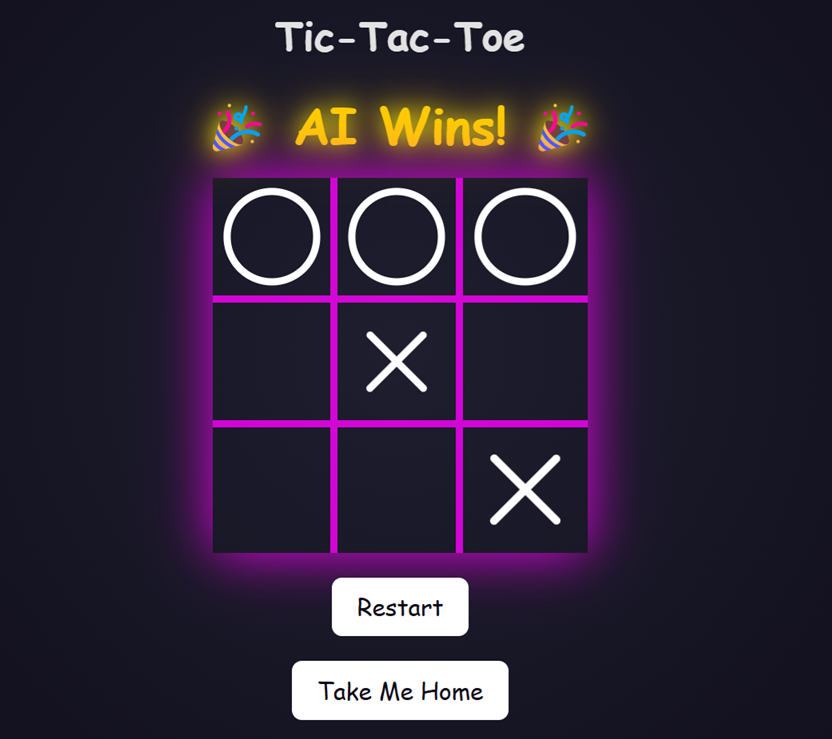

<div align="center">

# Qoraal Tic-Tac-Toe

<div align="center">


### This is what it all was for. Third door on the left, if you dare...


<div align="center">


<br>

</div>

<div align="center">
  
</div>
<br>
<div align="center">

#### Check this out first—then hit me.


<div align="left">


```cpp
decl_name       "tic-tac-toe"
decl_version    1

decl_events {
    _tictac_tick
    _tictac_restart
}

statemachine tictactoe {

    startstate ready

    state ready {
        /*
         * Entering the ready state signals readiness (html_ready) to render HTML 
         * when the _html_render event is received.
         */
        enter (html_ready)
        action (_tictac_restart, tictac_restart)
        action (_tictac_tick, tictac_play, [e])
        event (_html_render, html_head)

        /*
         * On receiving _html_render, transition to html_head.
         * The exit action begins the "text/html" response.
         * All subsequent html_emit calls append content to the response.
         */
        exit (html_response, HTML)
    }

    state html {
        enter (html_emit,       "<!DOCTYPE html>\r\n"
                                "<html lang=\"en\">\r\n")
        /*
         * Exiting the html superstate closes the document by emitting the </html> tag.
         */
        exit (html_emit,        "</html>\r\n")
    }

    super html {
        state html_head {
            /*
             * Engine Machine Language commands are single-line, 
             * but multi-line text blocks are supported. 
             * The closing bracket must be on the same line as the final text line.
             */
            enter (html_emit,   "<head>\r\n"
                                "<meta charset=\"UTF-8\">\r\n"
                                "<meta name=\"viewport\" content=\"width=device-width, initial-scale=1.0\">\r\n"
                                "<title>Tic-Tac-Toe</title>\r\n"
                                "<link rel=\"stylesheet\" href=\"/engine/tictaccss\">\r\n")
            event (_state_start, html_board_title)
            exit (html_emit,    "</head>\r\n")
        }
    }

    super html {
        /*
         * States can be nested. You can either nest them directly or repeat the "super" identifier.
         */
        state html_body {
            enter (html_emit,   "<body>\r\n")
            /*
             * html_subst_emit enables token substitution for identifiers in square brackets ([]).
             * Escape brackets if substitution is not intended.
             */
            exit (html_subst_emit,    "<button class=\"restart-btn\" onclick=\"window.location.href='/engine/tictactoe/[_tictac_restart]'\">Restart</button>\r\n"
                                "<button class=\"restart-btn\" onclick=\"window.location.href='/index'\">Take Me Home</button>"
                                "</body>")
        }

        super html_body {
            state html_board_title {
                action (_state_start, html_emit,                        "<h1>Tic-Tac-Toe</h1>\r\n")
                action_ld (_state_start, [a], tictac_status)
                action_eq (_state_start, TICTAC_DRAW,       html_emit,  "<div id=\"winner-message\" class=\"winner\"> Draw </div>\r\n\r\n")
                action_eq (_state_start, TICTAC_PLAYER_WIN, html_emit,  "<div id=\"winner-message\" class=\"winner\"> 👑 Player Wins! 👑 </div>\r\n")
                action_eq (_state_start, TICTAC_AI_WIN,     html_emit,  "<div id=\"winner-message\" class=\"winner\"> 🎉 AI Wins! 🎉 </div>\r\n")
                event (_state_start, html_board_cell)
            }
           
            state html_board {
                /*
                 * Reset the register [r] (cell counter) to zero before rendering the board.
                 */
                enter (r_load, 0)
                enter (html_emit,   "<div class=\"board\">\r\n")
                exit (html_emit,    "</div>\r\n")
            }

            super html_board {
                state html_board_cell {

                    /*
                     * Load the state of the cell [r] into the accumulator [a].
                     */
                    action_ld (_state_start, [a], tictac_cell, [r])

                    /*
                     * The action_eq compares the accumulator to the state each cell can be in. If equal, 
                     * the given html is emmited.
                     *
                     * If a cell is open, render it as a clickable link triggering a _tictac_tick event.
                     * The cell number is passed via the [e] event register.
                     */
                    action_eq (_state_start, TICTAC_OPEN,   html_subst_emit,"<div class=\"cell\">"
                                                                            "<a href=\"/engine/tictactoe/[_tictac_tick]/[r]\" "
                                                                            "class=\"invisible-link\"></a></div>\r\n")

                    action_eq (_state_start, TICTAC_PLAYER,     html_emit,  "<div class=\"cell x\"></div>\r\n")
                    action_eq (_state_start, TICTAC_AI,         html_emit,  "<div class=\"cell o\"></div>\r\n")
                    action_eq (_state_start, TICTAC_PLAYER_BLINK,   html_emit,  "<div class=\"cell x blink\"></div>\r\n")
                    action_eq (_state_start, TICTAC_AI_BLINK,       html_emit,  "<div class=\"cell o blink\"></div>\r\n")

                    /*
                     * Increment register [r] after processing each cell.
                     * Once [r] reaches 9, the accumulator [a] is set and the event transition to "ready".
                     * Otherwise, the event transition back to "html_board_cell" rendering the next cell.
                     */
                    action (_state_start, r_inc, 9)
                    event_nt (_state_start, html_board_cell)
                    event_if (_state_start, ready)
                }
            }     
        }
    }
}
```

## Quick Start  

This demo application can be compiled using the **POSIX port**, allowing you to evaluate it directly in a **GitHub Codespace** or on your PC! For embedded targets, the following RTOS options are supported: **ChibiOS, FreeRTOS, and ThreadX** (provided you have an IP stack like **LwIP**).  

⚠️ **Note:** If running in **GitHub Codespaces**, the application will use **port forwarding**. Once the web server starts on port 8080, you'll get a browser link for accessing the web interface on that port.

### Running on Windows/Linux/Codespace  

1. Open your development environment and clone the repository. If you use a **GitHub Codespace**, the repository is preloaded—just open a terminal (ctrl+`). 
2. Run the appropriate script based on your OS:  

```sh
# For Linux or Codespace:
$ sh ./build_and_run.sh  

# For Windows:
> build_and_run.bat  
```

3. When the application starts, a shell will open in the terminal, displaying **startup logs**. Look for `WSERV : : web server running on port 8080 without SSL!!`. 
4. Now you can access the web interface:
   - In a codespace, click on the link for the forwarded port. This should show in the `PORTS` tab of your terminal.
   - On your local PC, use **http://127.0.0.1:8080** (or your build machine’s local IP if running remotely).


That’s it—you're up and running! 🚀  Need more options? Check out [Qoraal Http](https://github.com/navaro/qoraal-http) and [Qoraal Engine](https://github.com/navaro/qoraal-engine).


On system startup, the Tic-Tac AI initializes with a model trained over 200,000 iterations. The initial model parameters were precomputed and stored to ensure immediate availability at launch.

:bulb: Tip: You can retrain your AI using the console command `tictactrain x`, where `x` is the number of iterations you want to train it for.

So dive in and experience how structured state machines can transform your approach to rendering, interactivity, and even game logic!


## Lets get into it
At its core, a hierarchical state machine can be powerful tool for structuring logic in a modular, maintainable way. When you use it to render structured text like HTML, you unlock flexible method for building dynamic web applications.

The **Qoraal Engine** and **Qoraal HTTP** framework leverages this concept by mapping state transitions to HTML rendering, it turns what could be a tangle of code into a clear, hierarchical process. This not only keeps your code neat and scalable but also makes development easy, as every state tells a part of the application's story.

**Qoraal Engine** goes even further by integrating backend logic, as demonstrated in the tic-tac-toe example. Functions `tictac_play`, `tictac_status`, and `tictac_cell` connect with the AI game backend, handling moves, checking game status, while `html_ready`, `html_response` and `html_emit` update the board rendering. The beauty of **Qoraal Engine** together with **Qoraal HTTP** is in how it unifies these components: the state machine manages the HTML output and user interactions, while the backend logic processes the game mechanics, resulting in a cohesive and dynamic experience.

With this approach, your web applications gain a structured backbone that’s easy to extend and maintain. Whether you're building interactive dashboards, dynamic content systems, or even AI-driven interfaces like this Tic-Tac-Toe game, **Qoraal Engine** streamlines the complexity into a modular, declarative flow. Now, it’s time to see it in action.


